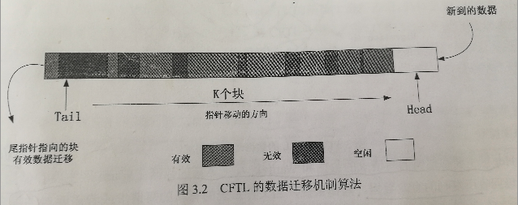
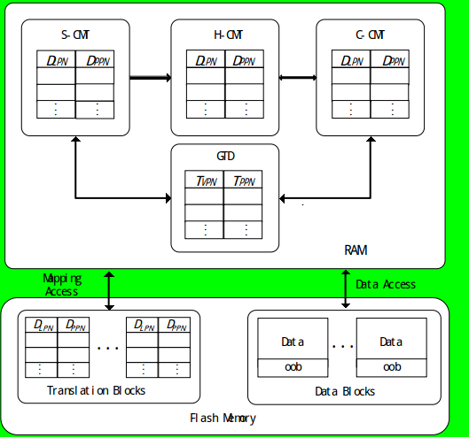
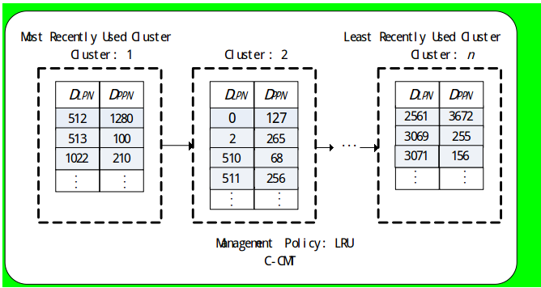

# CFTL
## 运行代码需要注意的地方
### 编译环境
代码是直接运行在Ubuntu10.04的机子上,gcc-2.95,在实验室的那台老机子上,我已经打包压缩好了,注意使用前备份
### 代码替换注意项
注意本代码不能直接独立编译运行!!!!只是Flashsim修改后的代码
Flashsim的代码必须编译运行在disksim3.0的仿真器上,因此必须先安装成功disksim+flashsim的仿真器后,将主目录下的src换成该CFTL的文件(注意改名为src),重新在主目录下make,编译成功后,进入test.release目录下进行配置操作运行
### 代码修改运行注意事项
采用git,在自己的电脑进行修改,之后push在老电脑上push同步直接运行编译查看错误修改,建议多了解ssh使用和git使用操作


## 算法的基本原理说明

### CFTL的FTL策略
在SLC采用循环队列策略
在MLC采用的是(师兄对比仿真采用了SDFTL,而原文采用BAST的混合地址映射的方式)
所有的代码SLC和MLC的读写操作都被师兄封装在了dftl.c中
SDFTL的代码逻辑在ssd_interface.c的callFsim中实现

### CFTL的数据分配机制
CFTL的数据分配机制根据负载的请求大小来进行热数据识别,并采用2均值聚类算法来自适应调整阈值大小,具体实现操作如下(十分简单):
	令C[]为一个一位数组,c[i]表示所有请求中2的i次幂个sector大小的请求的数量,其中接受到的请求最大为1024sector,因此算法中只需要11个计数器即可统计出2的0次幂到2的10次幂返回内写请求的大小的分布情况,注意是针对**写请求的**,注意**对于大小不是2的幂次方的写请求,其大小按照最接近的2的幂次方的值来处理**.下面就是2均值聚类的操作,随机选择两个值作为聚类的中心点,bababala,就是那老套路
    CFTL聚类后会有一个大的j和小的i的类中心.小的i就是判断阈值,小于i的请求都认为是热的,直接写入到SLC区域,大于i的直接写入到MLC区域.

### CFTL的数据迁移机制
CFTL将SLC区域当做循环队列使用,闪存块会按照物理块地址次序一次排列,第一块和最后一个块首位相互链接,如图所示:


head指向最新的空闲块,tail指向垃圾回收的目标块.初始状态,head和tail指针指向同一个位置,新来的数据写入到head指针指向的块,每当一个空闲块写满后,head指针前移.当SLC的空余块少于一定量的时候,启动垃圾回收机制,回收tail指针指向的块,然后将tail指针前移.任何一个指针超过最后一个物理块的时候,都将该指针指向第一个物理块.通过这种方式,在tail指针指向的物理块的有效数据更新频率更低,因此将tail指针指向的物理块被擦除前,直接将该块中的有效数据迁移到MLC区域中去.


# FTL算法相关算法说明

## 采用CFTL层的仿真代码实现
映射缓存DRAM被分为H-CMT，S-CMT，C-CMT，GTD４个部分．数据块区域用于实际的数据存储，转换块区域用于页级映射表的存储．H-CMT用于缓存访问频率较高的请求的映射项；C-CMT用于缓存访问频率低下的请求的映射项，以及当H-CMT满时从H-CMT剔除的、发生更新的映射项；S-CMT用于缓存高空间本地性请求（连续请求）的映射项．GTD的作用与DFTL的类似，用来记录转换块区域中每个页的地址映射项．其设计结构如图所示:

###  CPFTL关键结构
#### HCMT
H-CMT主要是用来缓存访问频繁的请求的映射项．当有请求到来，且请求的映射项在H-CMT中时，就可立即得到服务．当请求不在H-CMT，则到S-CMT 和C-CMT中查询．再者，H-CMT使用LRU策略对每个映射项进行管理．当H-CMT满时，选择最近最少访问的请求的映射项进行剔除．此时，若该映射项已更新，则将其剔除到C-CMT中，反之，则直接从缓存中剔除出去．
#### C-CMT
C-CMT主要用来缓存访问频率低的请求的映射项．一方面**，大小小于或者等于2KB的请求不在缓存中命中(第一次命中)时，都被认为是访问频率低的请求**，直接加载到C-CMT中；**另一方面，C-CMT还存储从H-CMT剔除的、发生更新的映射项．此外，若C-CMT中的映射项被二次访问，同样认为该请求为频繁访问请求**，需要将此映射项加载到H-CMT中．再者，C-CMT采用聚簇的思想，即将属于同一转换页中的映射项进行聚簇，并使用LRU策略对所有的簇进行管理，如图所示:


当C-CMT满后，按簇为单位进行剔除．选择剔除簇时，考虑到：一方面，若仅根据簇的映射项个数选择剔除簇，即选择映射项最多的簇进行剔除，则可能会使访问频率低下的簇对应的映射项长时间滞留在C-CMT中，浪费了宝贵的C-CMT缓存空间；另一方面，若仅根据LRU原则选择剔除簇，即选择最近最少访问的簇进行剔除，则可能造成每次剔除回收的缓存空间有限，从而造成经常的地址转换页访问，即增大地址转换页的读写开销．
**因此，CPFTL在选择剔除簇时，综合考虑簇的映射项个数和簇在LRU队列中的位置．具体来说，当C-CMT满时，先判断具有最多映射项的簇包含的映射项个数是否大于某个阈值，如果是，选择该簇进行剔除；否则，根据LRU原则选择最近最少访问簇进行剔除**
####  S-CMT 
S-CMT主要是用来缓存高空间本地性请求，也即连续请求的映射项．当一个新的请求到来时，**如果请求大小大于2KB，CPFTL便认为该请求具有连续性，进而1次加载1组连续的映射项到S-CMT中**．当请求在S-CMT再次命中后，则认为该请求为频繁访问请求，并把命中的映射项加载到H-CMT中．再者，S-CMT采用先进先出（first in first out，FIFO）的管理策略，即每次选择停留时间最长的1组映射项进行剔除或更新
### CPFTL层的伪代码
#### 主函数逻辑伪代码:
```
算法1.CPFTL.
 Input: request R with logical page number Rlpn, request size Rsize, request type Rtype;
 LPN = Rlpn, Size = Rsize;
 while Size ≠0 do
  if LPN hits H-CMT or S-CMT or C-CMT then
     service the request; 
       if LPN hits in S-CMT or C-CMT again then /*load the hit entry into H-CMT*/
         load the corresponding entry of LPN into H-CMT using 算法 2;
       end
  elseif Size ≤2 KB then /*load the entry into C-CMT*/
     load the corresponding entry of LPN into C-CMT using 算法 3;
     service the request;
  else/*load the entry into S-CMT*/
     load a group of entries into S-CMT using 算法 4;
       if Rtype is read then
         get the PPN by the entry;
       else /*Rtype is write*/
         service the request with new PPN;
       end
  end
  LPN ++;
  Size --;
 end

```
#### 加载频繁的访问项到H-CMT中
```
算法2
 Input: LPN;
 if H-CMT is full then
   select the victim entry according to LRU policy;
   if the victim entry is updated then /*load this entry into C-CMT*/
     update the entries of C-CMT using 算法 3;
   else
     directly discard the entry form H-CMT;
   end
 end
 load the corresponding entry of LPN into H-CMT
```
#### 将H-CMT中淘汰的数据映射项到C-CMT中
```
算法3：C-CMT update.
 Input: LPN;
 if C-CMT is full then
   if entries’number of cluster which owns the maximum entries > Threshold then
     evict this cluster from C-CMT;
   else
     evict the least recently used cluster from C-CMT;
   end
 end
 load the corresponding entry of LPN into C-CMT
```
#### 将判断为连续请求的数据映射项预取到S-CMT中
```
算法4：S-CMT update.
 Input: LPN;
  if S-CMT is full then
   evict a group of entries from the S-CMT according to FIFO policy;
  end
 load the corresponding entry of LPN and the following some entries into S-CMT
```

# 关于CFTL的代码实现的细节
## 阈值th的更新
CFTL的th是根据一定周期内的请求的大小进行2聚类，以最小的聚类点为阈值，小于这个th的值数据写入到SLC中区，大于写入到MLC中去。
代码逻辑的实现位于源文件`disksim_iotrace.c`中具体的函数`static ioreq_event * iotrace_ascii_get_ioreq_event_1 (FILE *tracefile, ioreq_event *new)`：
这个函数的全部定义和关键注释如下
```cpp
static ioreq_event * iotrace_ascii_get_ioreq_event_1 (FILE *tracefile, ioreq_event *new)
{
   char line[201];
   int sbcount,mbcount,threhold,diff,Es,Em,sblkno,ssblkno;
   _u32 RWs,RWm;
   int cnt,i,j,ppn;
   sect_t s_psn,s_psn1,s_lsn;
   blk_t pbn,pin;
   if (fgets(line, 200, tracefile) == NULL) {
      addtoextraq((event *) new);
      return(NULL);
   }
   if (sscanf(line, "%lf %d %d %d %x\n", &new->time, &new->devno, &new->blkno, &new->bcount, &new->flags) != 5) {
      fprintf(stderr, "Wrong number of arguments for I/O trace event type\n");
      fprintf(stderr, "line: %s", line);
      ddbg_assert(0);
   }

   //flashsim
   //SLL_stat_erase_num和MLC_stat_erase_num是全局统计变量，用以统计计算SLC和MLC的磨损速度
   RWs=SLC_stat_erase_num/40960;
   RWm=MLC_stat_erase_num/4096;
  // RWs=SLC_stat_erase_num/1000;
  // RWm=MLC_stat_erase_num/100;
   diff=abs(RWs-RWm);
   Es=SLC_stat_erase_num%40960;
   Em=MLC_stat_erase_num%4096;
   threhold=abs(Es-Em);
   //flag==0就是写请求，需要判断写入的是SLC还是MLC
  if(new->flags==0){ 
     printf("SLC磨损速度：%d\n",SLC_stat_erase_num);
     printf("MLC磨损速度：%d\n",MLC_stat_erase_num);
     w_size[w_count]=new->bcount;                
     w_count++;
    //师兄的仿真确定的CFTL的更新th的周期是1000
     if(w_count==1000){
        w_count=0;
        //但是不是严格意义上的聚类，而是将所有的请求大小进行累加除1000+3？？
        for(i=0;i<1000;i++){
          sum+=w_size[i];         
        }
        th=sum/1000+3;
        sum=0;
     } 
     printf("th的值：%d\n ",th);
     //做根据2k数据页的扇区和页对齐
     sblkno=new->blkno;
     sbcount=((new->blkno+ new->bcount-1)/4 - (new->blkno)/4 + 1) * 4;
     sblkno /= 4;
     sblkno *= 4;
     cnt= (sblkno+ sbcount-1)/4 - (sblkno)/4 + 1;
     //判断请求大小和当前阈值决定写入SLC（flash_op_flag=0）
     if(new->bcount<=th){
     	//比阈值小，决定写到SLC中去
        if(RWs<=RWm){
        //当前的SLC磨损速度比MLC低
        //存入SLC的地址都要减去这个基数？
           if(new->blkno>=1048544){
           //1048544转化为地址差不多512MB，（实验SLC最大容量）
              new->blkno=new->blkno-1048544;
           }
           new->flash_op_flag=0;
           new->bcount=((new->blkno+ new->bcount-1)/4 - (new->blkno)/4 + 1) * 4;
           new->blkno /= 4;
           new->blkno *= 4;
        }else{
        //当前SLC的磨损速度高于或等于当前的MLC的速度
           ssblkno=new->blkno;
           if(ssblkno>=1048544){
              ssblkno=ssblkno-1048544;
           }
           //估计是取余数hash了，因为地址差不多1G，而SLC最大的地址为512MB
           if(SLC_opagemap[ssblkno/4].free==0) {
           //要写入的数据页之前的数据页存在SLC中，还是要写入到SLC中更新
              if(new->blkno>=1048544){
                 new->blkno=new->blkno-1048544;
              }
              new->flash_op_flag=0;
              new->bcount=((new->blkno+ new->bcount-1)/4 - (new->blkno)/4 + 1) * 4;
              new->blkno /= 4;
              new->blkno *= 4;
           }else{
           //否则直接写入到MLC中，注意到这里的地址大小没有减去1048544，但页对齐大小是4K的
              new->flash_op_flag=1;
              new->bcount = ((new->blkno+ new->bcount-1)/8 - (new->blkno)/8 + 1) * 8;
              new->blkno /= 8;
              new->blkno *= 8;
           }
        }
     }else{
     	//大请求直接写入到MLC中
        new->flash_op_flag=1;
        new->bcount = ((new->blkno+ new->bcount-1)/8 - (new->blkno)/8 + 1) * 8;
        new->blkno /= 8;
        new->blkno *= 8;
     }
  }else{
  //如果new->flag!=0 读请求，直接交给MLC？
     new->flash_op_flag=1;
     new->bcount = ((new->blkno+ new->bcount-1)/8 - (new->blkno)/8 + 1) * 8;
     new->blkno /= 8;
     new->blkno *= 8;
  }
  //和req队列操作的代码
  if (new->flags & ASYNCHRONOUS) {
     new->flags |= (new->flags & READ) ? TIME_LIMITED : 0;
  } else if (new->flags & SYNCHRONOUS) {
     new->flags |= TIME_CRITICAL;
  }

   new->buf = 0;
   new->opid = 0;
   new->busno = 0;
   new->cause = 0;
   return(new);
}
```
###
这里确定函数的调用关系，通过GDB调试确定的，通过bt看到函数的依次调用关系
```bash
#0  iotrace_ascii_get_ioreq_event_1 (tracefile=0x955f208, new=0x99bd688)
at disksim_iotrace.c:614
#1  0x08056cb3 in iotrace_get_ioreq_event (tracefile=0x955f208, traceformat=1, 
    temp=0x99bd688) at disksim_iotrace.c:726
#2  0x08059839 in io_get_next_external_event (iotracefile=0x955f208)
    at disksim_iosim.c:678
#3  0x0804bfb5 in getnextevent () at disksim.c:614
#4  0x0804af9c in disksim_simulate_event (num=0) at disksim.c:731
#5  0x0804ba4c in disksim_run_simulation () at disksim.c:1008
#6  0x08049553 in main (argc=6, argv=0xbffff684) at disksim_main.c:192
 
```
函数` iotrace_get_ioreq_event`执行的代码调用片段,存在另一个对应的函数` iotrace_ascii_get_ioreq_event_0`
```cpp
#1  0x08056cb3 in iotrace_get_ioreq_event (tracefile=0x955f208, traceformat=1, 
    temp=0x99bd688) at disksim_iotrace.c:726
726	        temp = iotrace_ascii_get_ioreq_event_1(tracefile, temp);
(gdb) l
721	      
722	   case ASCII:
723	      if(IO_trace==0)
724	         temp = iotrace_ascii_get_ioreq_event_0(tracefile, temp);
725	      else
726	        temp = iotrace_ascii_get_ioreq_event_1(tracefile, temp);
727	      break;
728	      
729	   case RAW:
730	      temp = iotrace_raw_get_ioreq_event(tracefile, temp);
.......

```
函数` iotrace_ascii_get_ioreq_event_0`和` iotrace_ascii_get_ioreq_event_1`处理差不多，但是该函数是直接判断请求大小小于5，就直接写入SLC，反之MLC
```cpp
static ioreq_event * iotrace_ascii_get_ioreq_event_0 (FILE *tracefile, ioreq_event *new)
{
   char line[201];
   int sbcount,mbcount;
   if (fgets(line, 200, tracefile) == NULL) {
      addtoextraq((event *) new);
      return(NULL);
   }
   if (sscanf(line, "%lf %d %d %d %x\n", &new->time, &new->devno, &new->blkno, &new->bcount, &new->flags) != 5) {
      fprintf(stderr, "Wrong number of arguments for I/O trace event type\n");
      fprintf(stderr, "line: %s", line);
      ddbg_assert(0);
   }

   //flashsim
   sbcount = ((new->blkno+ new->bcount-1)/4 - (new->blkno)/4 + 1) * 4;
   mbcount = ((new->blkno+ new->bcount-1)/8 - (new->blkno)/8 + 1) * 8;
//   小于固定阈值5就直接网SLC写？？
   if(new->bcount<=5){
       // 4
       if(new->blkno>=1048544){
            new->blkno=new->blkno-1048544; 
       }
       new->bcount=((new->blkno+ new->bcount-1)/4 - (new->blkno)/4 + 1) * 4;
       new->blkno /= 4;
       new->blkno *= 4;
       new->flash_op_flag=0; 
   } else{ 
       new->bcount=((new->blkno+ new->bcount-1)/8 - (new->blkno)/8 + 1) * 8;
       new->blkno /= 8;
       new->blkno *= 8;
       new->flash_op_flag=1; 
   }
   
   
   if (new->flags & ASYNCHRONOUS) {
      new->flags |= (new->flags & READ) ? TIME_LIMITED : 0;
   } else if (new->flags & SYNCHRONOUS) {
      new->flags |= TIME_CRITICAL;
   }

   new->buf = 0;
   new->opid = 0;
   new->busno = 0;
   new->cause = 0;
   return(new);
}
```
这里涉及变量`IO_trace`该全局变量在两个地方进行置位一个是在函数`disksim_run_simulation ()`：

```cpp
void disksim_run_simulation ()
{
  int event_count = 0;
  delay2=0;
  IO_trace=1;
  while (disksim->stop_sim == FALSE) {
    disksim_simulate_event(event_count);
    event_count++;
  }
//  printf("disksim_run_simulation(): simulated %d events\n", event_count);
}

```
另一个置位是在`prime_simulation ()`
```cpp
static void prime_simulation ()
{
   event *curr;
   IO_trace=0;
   if (disksim->warmup_event) {
      addtointq((event *)disksim->warmup_event);
      disksim->warmup_event = NULL;
   }
   if (disksim->checkpoint_interval > 0.0) {
      disksim_register_checkpoint (disksim->checkpoint_interval);
   }
   if (disksim->iotrace) {
      if ((curr = io_get_next_external_event(disksim->iotracefile)) == NULL) {
         disksim_cleanstats();
         return;
      }
      if ((disksim->traceformat != VALIDATE) && (disksim->closedios == 0)) {
         curr->type = NULL_EVENT;
      } else if (disksim->closedios) {
         int iocnt;
         io_using_external_event(curr);
         curr->time = simtime + disksim->closedthinktime;
         for (iocnt=1; iocnt < disksim->closedios; iocnt++) {
            curr->next = io_get_next_external_event(disksim->iotracefile);
            if (curr->next) {
               io_using_external_event(curr->next);
               curr->time = simtime + disksim->closedthinktime;
               addtointq(curr->next);
            }
         }
      }
      addtointq(curr);
   }
}
```
根据GDB调试，查看函数执行次序，`prime_simulation ()`在预热之前设置，即预热的时候，采用的是固定的阈值5写入的，之后预热完，执行函数`disksim_run_simulation ()`则采用CFTL的周期更改阈值的方式。
## 关于SLC和MLC的比例修改，如何修改，设计修改的变量的地方
首先查看`ssd_interface.c`的函数`initFlash`的关键代码片段
```cpp
  blk_t total_blk_num;
  blk_t total_SLC_blk_num;
  blk_t total_MLC_blk_num;
  blk_t total_util_blk_num;
  blk_t total_extr_blk_num;
  blk_t total_SLC_util_blk_num;
  blk_t total_SLC_extr_blk_num;
  blk_t total_MLC_util_blk_num;
  blk_t total_MLC_extr_blk_num;

  // total number of sectors    
  // 相关的SLC的宏定义在disksim_global.h中
  //   #define total_SLC_util_sect_num  1048576//1048576 --->(2k) 4096个块  512MB
  // #define total_SLC_extra_sect_num  32768//32768 -->(2k)  128个空闲块 16MB
  // 所以在配置文件应该配置为2G，保证MLC有1.5GB左右的剩余地址
  total_util_sect_num  = flash_numblocks;
  total_extra_sect_num = flash_extrblocks;
  total_MLC_util_sect_num  = total_util_sect_num-total_SLC_util_sect_num;
  total_MLC_extra_sect_num = total_extra_sect_num-total_SLC_extra_sect_num;
  total_sect_num = total_util_sect_num + total_extra_sect_num;
  total_SLC_sect_num=total_SLC_util_sect_num+total_SLC_extra_sect_num;
  total_MLC_sect_num=total_MLC_util_sect_num+total_MLC_extra_sect_num; 

  // total number of blocks 
  total_SLC_blk_num  = total_SLC_sect_num / S_SECT_NUM_PER_BLK;     
  total_MLC_blk_num  = total_MLC_sect_num / M_SECT_NUM_PER_BLK;
  total_blk_num =total_SLC_blk_num + total_MLC_blk_num; 

  total_SLC_util_blk_num = total_SLC_util_sect_num / S_SECT_NUM_PER_BLK;    
  total_MLC_util_blk_num = total_MLC_util_sect_num / M_SECT_NUM_PER_BLK;
  total_SLC_extr_blk_num = total_SLC_extra_sect_num / S_SECT_NUM_PER_BLK;
  total_MLC_extr_blk_num = total_MLC_extra_sect_num / M_SECT_NUM_PER_BLK;
  total_util_blk_num = total_SLC_util_blk_num + total_MLC_util_blk_num;
  global_total_blk_num = total_util_blk_num;

  total_extr_blk_num = total_blk_num - total_util_blk_num;        // total extra block number
```
总的来说SLC的大小通过代码写死，配置文件里面的设定大小减去SLC为MLC的大小
但SLC的宏大小会影响一下函数中的变量（目前已知）
```cpp
iotrace_ascii_get_ioreq_event_0()
iotrace_ascii_get_ioreq_event_1()
写入SLC的减去的偏移量1048544
dftl.c中SLC的写入（因为采用循环队列，头尾块的截止地址）
同时和SLC_opagemap的个数应该紧密相关
```
因为CFTL的SLC的数据迁移直接将尾部的回收块中的有效数据页直接回写到MLC中，不存在N次策略的问题。所以dftl.c中的SLC to MLC较为简单